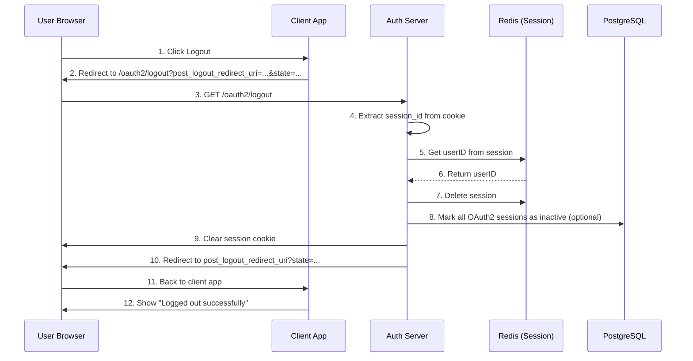

# Logout Flow (RP-Initiated Logout)

## Tổng quan

Logout flow triển khai theo OpenID Connect RP-Initiated Logout specification, cho phép user logout khỏi Authorization Server và optionally redirect về Relying Party (Client Application).

## Spec Reference

- **OpenID Connect RP-Initiated Logout 1.0**: https://openid.net/specs/openid-connect-rpinitiated-1_0.html

## Endpoint

```
GET/POST /oauth2/logout
```

## Request Parameters

Tất cả parameters đều **optional**:

| Parameter | Type | Description |
|-----------|------|-------------|
| `id_token_hint` | string | ID Token được issued trước đó, dùng để hint về user session cần logout |
| `post_logout_redirect_uri` | string | URL để redirect sau khi logout thành công (phải được whitelist) |
| `state` | string | Opaque value để maintain state giữa logout request và callback |

## Flow Sequence



## Implementation Details

### 1. Session Cleanup

Khi logout, hệ thống thực hiện:

1. **Delete User Session** (Redis):
   ```
   DEL session:{session_id}
   ```

2. **Revoke OAuth2 Tokens** (PostgreSQL - Optional):
   ```sql
   UPDATE identify.oauth2_sessions
   SET active = FALSE
   WHERE subject_id = $1 AND active = TRUE
   ```

### 2. Token Revocation Strategy

Có 2 chiến lược cho token revocation:

**Strategy 1: Soft Logout (Default)**
- Chỉ xóa session cookie
- OAuth2 tokens vẫn valid cho đến khi expire
- ✅ User bị logout khỏi web session
- ❌ Access tokens vẫn có thể được sử dụng bởi client apps

**Strategy 2: Hard Logout (revokeTokens = true)**
- Xóa session cookie
- Revoke tất cả OAuth2 tokens của user
- ✅ User bị logout hoàn toàn
- ✅ Tất cả access tokens bị vô hiệu hóa
- ⚠️ Tất cả client apps phải re-authenticate

Hiện tại implementation sử dụng **Strategy 1** (Soft Logout) để tránh breaking các client apps đang sử dụng valid tokens.

### 3. Security Considerations

#### Redirect URI Validation

⚠️ **IMPORTANT**: `post_logout_redirect_uri` PHẢI được validate để tránh Open Redirect vulnerability.

```go
// TODO: Implement in production
func (h *Handler) validatePostLogoutRedirectURI(clientID, redirectURI string) error {
    // 1. Get client từ database
    // 2. Check redirectURI có trong client.PostLogoutRedirectURIs không
    // 3. Return error nếu invalid
}
```

#### CSRF Protection

- Logout endpoint hỗ trợ cả GET và POST
- GET: Thuận tiện cho browser redirects
- POST: An toàn hơn, nên được sử dụng khi possible

#### Cookie Security

Session cookie được clear với các flags:
```go
c.SetCookie(
    "session_id",
    "",
    -1,     // MaxAge -1 = delete immediately
    "/",    // path
    "",     // domain
    false,  // secure (MUST be true in production with HTTPS)
    true,   // httpOnly (prevent XSS)
)
```

## Usage Examples

### Example 1: Simple Logout (No Redirect)

**Request:**
```http
GET /oauth2/logout HTTP/1.1
Host: auth.example.com
Cookie: session_id=abc123...
```

**Response:**
```http
HTTP/1.1 200 OK
Set-Cookie: session_id=; Path=/; Max-Age=-1; HttpOnly

{
  "message": "Logged out successfully"
}
```

### Example 2: Logout with Redirect

**Request:**
```http
GET /oauth2/logout?post_logout_redirect_uri=https://app.example.com/goodbye&state=xyz789 HTTP/1.1
Host: auth.example.com
Cookie: session_id=abc123...
```

**Response:**
```http
HTTP/1.1 302 Found
Location: https://app.example.com/goodbye?state=xyz789
Set-Cookie: session_id=; Path=/; Max-Age=-1; HttpOnly
```

### Example 3: Client-Initiated Logout (from Client App)

**Client-side code:**
```javascript
// In your client application
function logout() {
    // Construct logout URL
    const logoutUrl = new URL('https://auth.example.com/oauth2/logout');
    logoutUrl.searchParams.set('post_logout_redirect_uri', 'https://app.example.com/');
    logoutUrl.searchParams.set('state', generateRandomState());

    // Redirect user to logout endpoint
    window.location.href = logoutUrl.toString();
}
```

## Error Handling

### No Session

Nếu user không có session (hoặc session đã expired):
- Vẫn return success (idempotent)
- Clear cookie anyway
- Redirect về `post_logout_redirect_uri` nếu có

### Invalid Redirect URI

```http
HTTP/1.1 400 Bad Request

{
  "error": "invalid_request",
  "error_description": "post_logout_redirect_uri is not registered for this client"
}
```

## Production Checklist

- [ ] Validate `post_logout_redirect_uri` against client's registered URIs
- [ ] Set `secure: true` cho cookies trong production (HTTPS)
- [ ] Implement proper CORS headers
- [ ] Add rate limiting cho logout endpoint
- [ ] Log logout events cho security audit
- [ ] Implement Front-Channel Logout notification (optional)
- [ ] Implement Back-Channel Logout notification (optional)

## Related Endpoints

- `POST /oauth2/revoke` - Revoke individual tokens
- `GET /oauth2/auth` - Authorization endpoint
- `POST /oauth2/token` - Token endpoint

## OpenID Connect Discovery

Logout endpoint được advertise trong OpenID Connect Discovery document:

```json
{
  "issuer": "https://auth.example.com",
  "end_session_endpoint": "https://auth.example.com/oauth2/logout",
  ...
}
```

Xem: `GET /.well-known/openid-configuration`
